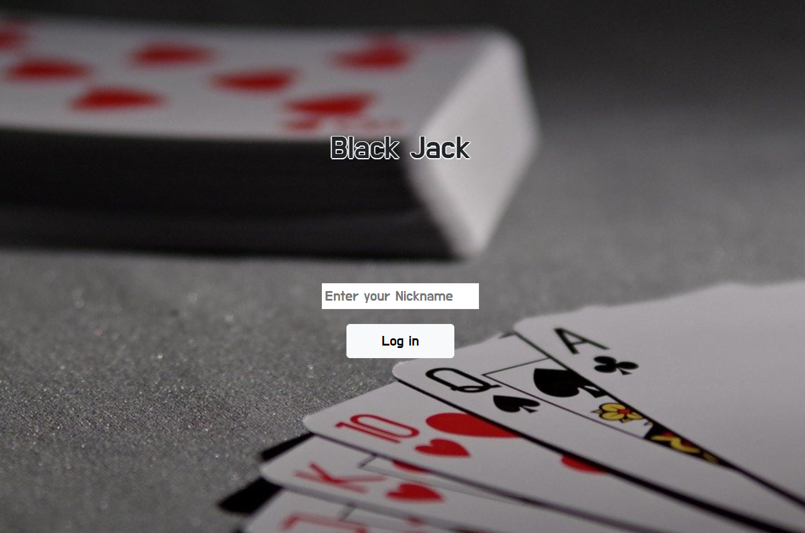
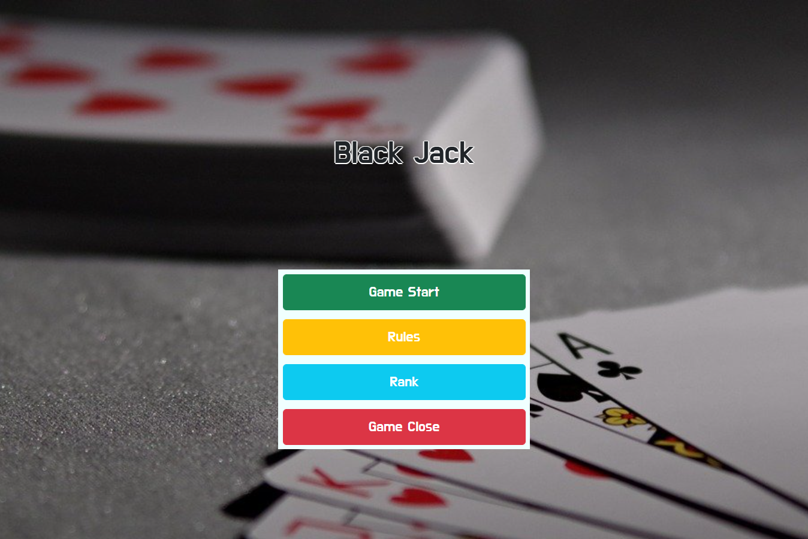
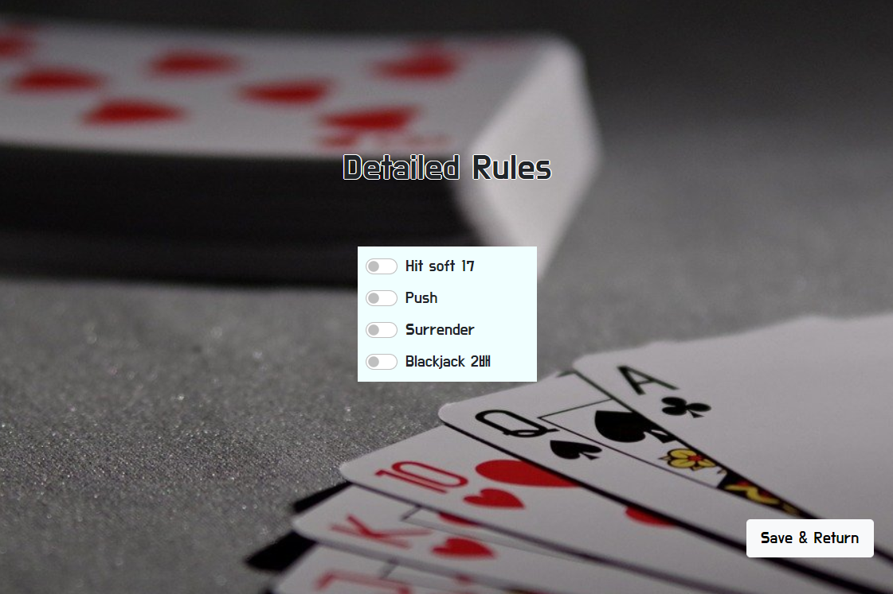
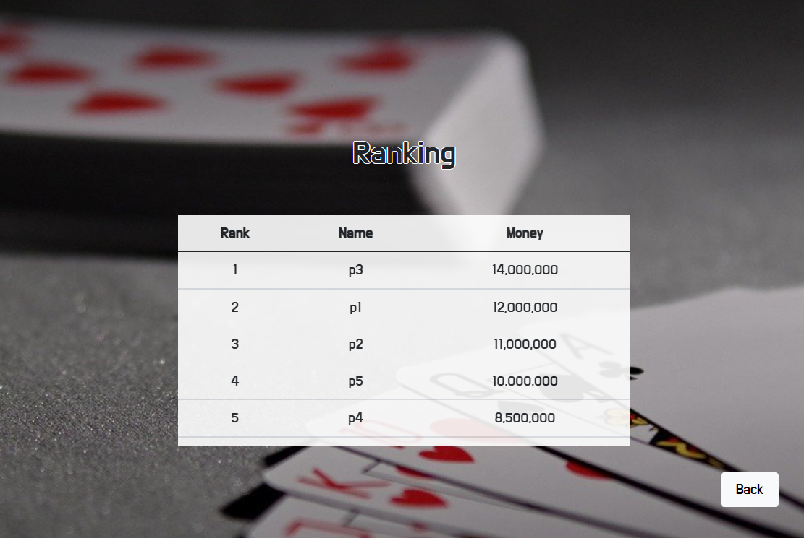

# 블랙 잭  

## 소개말
블랙 잭 게임을 보다 더 편리하게 즐기세요!
- 닉네임 설정 및 순위 기록 기능 지원
- 사용자가 원하는 대로 세부 규칙 설정 가능
- 자연스러운 카드 애니매이션과 효과음!
## 닉네임 설정
    

새로운 사용자라면 신규 닉네임을 입력하세요!  
혹은 이전에 사용하던 닉네임을 입력하면 사용자 정보를 그대로 이용할 수 있습니다.  
__Log In__ 버튼을 통해 메인 페이지로 이동할 수 있습니다.
## 메인 페이지
  

__Game Start__ 버튼을 누르면 게임 진행 페이지로 이동하여 게임을 즐길 수 있습니다!  
__Rules__ 버튼을 통해 세부 규칙 설정 페이지로 이동할 수 있습니다.  
__Rank__ 버튼을 통해 사용자 랭킹 페이지로 이동할 수 있습니다.  
__Game Close__ 버튼을 누르면 사용자 닉네임 설정 페이지로 되돌아갑니다.  
## 게임 진행 페이지
  
  
  
  

우측 상단 UP, DOWN 버튼으로 배팅액을 설정하고, Start 버튼으로 게임을 시작하세요!  
HIT, STAY 등의 버튼으로 게임을 진행할 수 있으며,  
좌측 하단에서 현재 보유 금액 및 전적을 확인할 수 있습니다.
## 세부 규칙 설정 및 랭킹 페이지
  

__Hit soft17__ 룰을 적용하면 딜러가 A를 포함한 17일때 hit을 하게 됩니다.   
__Push__ 룰을 적용하면 딜러와 플레이어의 카드합이 같을 때 무승부가 됩니다.   
__Surrender__ 룰을 적용하면 플레이어가 자신의 배팅금의 반만 내고 경기를 포기할 수 있습니다.   
__BlackJack 2배__ 룰을 적용하면 플레이어나 딜러가 BlackJack일때 기존 1.5배의 배팅금이 아닌 2배의 배팅금을 받게 됩니다.   
  

탑5까지 등록되는 랭킹 페이지!   
본인의 랭킹을 확인하세요.    
## 게임 설치 및 실행
1) git clone 및 npm을 통한 설치 및 실행
   
   ```
   git clone https://github.com/bansh123/OSS_Final_BlackJack.git  
   npm install electron  
   npm start
2) 직접 다운로드  
releases에 업로드 되어있는 BlackJack.zip 파일을 받으신 후,  
압축해제 후 out/oss_final_blackjack-win32-x64/oss_final_blackjack.exe 를 실행하세요.
